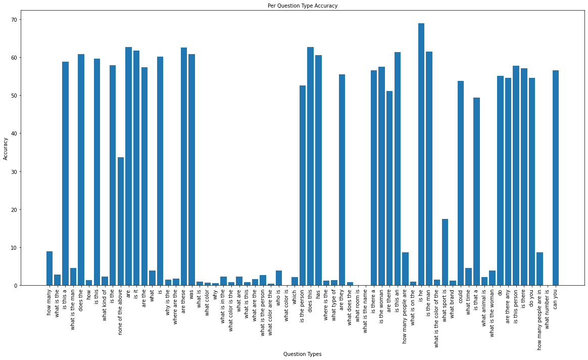
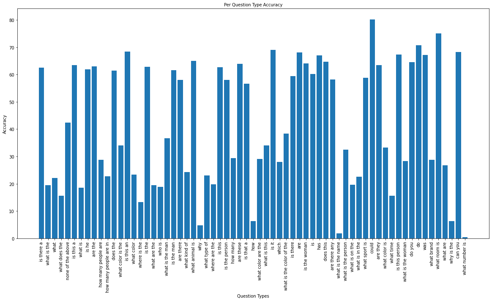
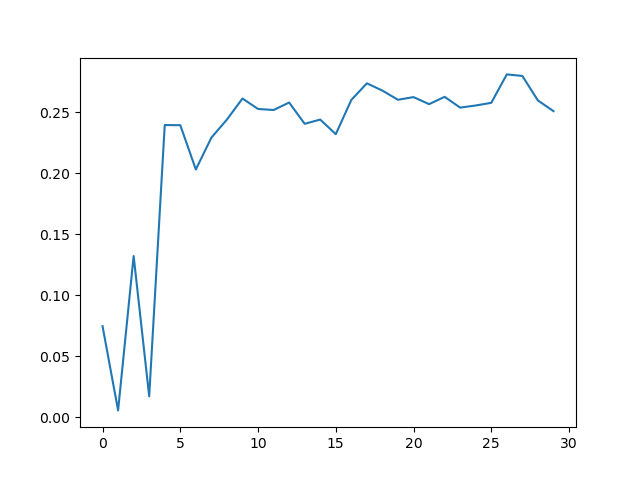

# NaiveVQA -- Mindspore Implementation

This repository contains a naive VQA model, which is our final project (**mindspore** implementation) for course DL4NLP at ZJU. It's a reimplementation of the paper [Show, Ask, Attend, and Answer: A Strong Baseline For Visual Question Answering](https://arxiv.org/abs/1704.03162).

> Checkout branch `pytorch` for our **pytorch** implementation.

```bash
git checkout pytorch
```

## Performance

| Framework | Y/N  | Num  | Other | All  |
| --------- | ---- | ---- | ----- | ---- |
| **MindSpore** | 62.2 | 7.5  | 2.4  | **25.8** |
| **PyTorch**   | 66.3 | 24.5 | 25.0  | **40.6** |

* Per Question Type Accuracy (**Mindspore**)


* Per Question Type Accuracy (**PyTorch**)


## File Directory

* `data/`
    * `annotations/` -- annotations data (ignored)
    * `images/` -- images data (ignored)
    * `questions/` -- questions data (ignored)
    * `results/` -- contains evaluation results when you evaluate a model with `./evaluate.ipynb`
    * `clean.py` -- a script to clean up `train.json` in both `data/annotations/` and `data/questions/`
    * `align.py` -- a script to sort and align up the annotations and questions
* `resnet/` -- resnet directory, cloned from [pytorch-resnet](https://github.com/Cyanogenoid/pytorch-resnet/tree/9332392b01317d57e92f81e00933c48f423ff503)
* `logs/` -- should contain saved `.pth` model files
* `config.py` -- global configure file
* `train.py` -- training
* `view-log.py` -- a tool for visualizing an accuracy\epoch figure
* `val_acc.png` -- a demo for the accuracy\epoch figure
* `model.py` -- the major model
* `preprocess-image.py` -- preprocess the images, using ResNet152 to extract features for further usages
* `preprocess-image-test.py` -- to extract images in the test set
* `preprocess-vocab.py` -- preprocess the questions and annotations to get their vocabularies for further usages
* `data.py` -- dataset, dataloader and data processing code
* `utils.py` -- helper code
* `evaluate.ipynb` -- evaluate a model and visualize the result
* `cover_rate.ipynb` -- calculate the selected answers' coverage
* `assets/`
* `PythonHelperTools/` (currently not used)
    * `vqaDemo.py` -- a demo for VQA dataset APIs
    * `vqaTools/`
* `PythonEvaluationTools/` (currently not used)
    * `vqaEvalDemo.py` -- a demo for VQA evaluation
    * `vaqEvaluation/`
* `README.md`

## Prerequisite

* Free disk space of at least 60GB
* Nvidia GPU / Ascend Platform

> **Notice**: We have successfully tested our code with **MindSpore 1.2.1** on **Nvidia RTX 2080ti**. Thus we strongly suggest you use MindSpore 1.2.1 GPU version. Since MindSpore is definitely not stable, any version different from 1.2.1 might cause failures.

> Also, due to some incompatibility among different versions of MindSpore, we still can't manage to run the code on Ascend now. Fortunately, people are more possible to have an Nvidia GPU rather than an Ascend chip :)

## Quick Begin

### Get and Prepare the Dataset

Get our VQA dataset (a small subset of VQA 2.0) from [here](https://drive.google.com/open?id=1_VvBqqxPW_5HQxE6alZ7_-SGwbEt2_zn). Unzip the file and move the subdirectories

* `annotations/`
* `images/`
* `questions/`

into the repository directory `data/`.

Prepare your dataset with:

```bash
# Only run the following command once!

cd data

# Save the original json files
cp annotations/train.json annotations/train_backup.json
cp questions/train.json questions/train_backup.json
cp annotations/val.json annotations/val_backup.json
cp questions/val.json questions/val_backup.json
cp annotations/test.json annotations/test_backup.json
cp questions/test.json questions/test_backup.json

python clean.py # run the clean up script
mv annotations/train_cleaned.json annotations/train.json
mv questions/train_cleaned.json questions/train.json

python align.py # run the aligning script
mv annotations/train_cleaned.json annotations/train.json
mv annotations/val_cleaned.json annotations/val.json
mv annotations/test_cleaned.json annotations/test.json

mv questions/train_cleaned.json questions/train.json
mv questions/val_cleaned.json questions/val.json
mv questions/test_cleaned.json questions/test.json
```

The scripts upon would

* clean up your dataset (there are some images whose ids are referenced in the annotation & question files, while the images themselves don't exist!)
* align the questions' ids for convenience while training

### Preprocess Images

> You actually don't have to preprocess the images yourself. We have prepared the prerocessed features file for you, feel free to download it through [here](https://e-share.obs-website.cn-north-1.myhuaweicloud.com?token=jA7oiibO5h2G1jmMINVC+oum3Lfah+Ut5bGgDFeTu5sI4zchCijmfATwP8KLRi9T5n7q00BW/bs2ugmV6RsBjmPdOUWaQEBJ0Fm0ND9DIrBCRfNNYmqbIH+Q2J0VgDY70KEHNOK3GW+0179M5NphG9YUSz9+JT3f4G3Jx4MLo6zky+l2nB6VdYLBxGspSx98Iq566+3aRL7NFJ/KbSRtUesX9iHSFJaFyBNNeyflZyzTQOmvs+xK17NWIeeJ7zdTuk/ojRn157m0m8uNzKg8+KQawvp53i/4y6kZ1qMh/ryBfjHsKIP18vz6OD0htixD66E/lr450IxpQHzqWp35Lixr8pptgrtBE4aWkcsvjTpupOfZdnqSzLY91QzCqU2578RDctILAb8mpvURWd7im2yUZUexBCsdCzp4HHUL1H3+C6UCTPe7XMDtz4yWhsZFATstbIHs6opMs3Ktp5/6HfA976nJJeJZnjLQp8NxwTVAoPUsckIxwFplhCIkpE38IrBq6mndpEP8G0VHLIKzYfDn6pS83JNzl4EPxknKkNL22OyWAge3ZC+Gh1mqrvCq) (the passcode is 'dl4nlp'). You should download the `resnet-14x14.h5` (42GB) file and place it at the repository root directory. Once you've done that, skip this chapter!

**Preprocess the images** with:

```bash
python preprocess-images.py
```

* If you want to accelerate it, tune up `preprocess_batch_size` at `config.json`
* If you run out of CUDA memory, tune down `preprocess_batch_size` ata `config.json`

The output should be `./resnet-14x14.h5`.

### Preprocess Vocabulary

> The vocabulary only depends on the **train** set, as well as the `config.max_answers` (the number of selected candidate answers) you choose.

**Preprocess the questions and annotations** to get their vocabularies with:

```bash
python preprocess-vocab.py
```

The output should be `./vocab.json`.

Now, you can **train the model** with:

```bash
python train.py
```

During training, a '.ckpt' file and a '.json' file would be saved under `./logs`. The `.ckpt` file contains the parameters of your model and can be reloaded. The `.json` file contains training metainfo records.

**View the training process** with:

```bash
python view-log.py <path to .json train record>
```

The output `val_acc.png` should look like this:



> To continue training from a pretrained model, set the correct `pretrained_model_path` and the `pretrained` to True in `config.py`.

## Test Your Model

Likewise, you need to preprocess the test set's images before testing. Run

```bash
python preprocess-images-test.py
```

to extract features from `test/images`. The output should be `./resnet-14x14-test.h5`.

> Likewise, we have prepared the `resnet-14x14-test.h5` for you. Download it [here](https://e-share.obs-website.cn-north-1.myhuaweicloud.com?token=jA7oiibO5h2G1jmMINVC+oum3Lfah+Ut5bGgDFeTu5sI4zchCijmfATwP8KLRi9T5n7q00BW/bs2ugmV6RsBjmPdOUWaQEBJ0Fm0ND9DIrBCRfNNYmqbIH+Q2J0VgDY70KEHNOK3GW+0179M5NphG9YUSz9+JT3f4G3Jx4MLo6zky+l2nB6VdYLBxGspSx98Iq566+3aRL7NFJ/KbSRtUesX9iHSFJaFyBNNeyflZyzTQOmvs+xK17NWIeeJ7zdTuk/ojRn157m0m8uNzKg8+KQawvp53i/4y6kZ1qMh/ryBfjHsKIP18vz6OD0htixD66E/lr450IxpQHzqWp35Lixr8pptgrtBE4aWkcsvjTpupOfZdnqSzLY91QzCqU2578RDctILAb8mpvURWd7im2yUZUexBCsdCzp4HHUL1H3+C6UCTPe7XMDtz4yWhsZFATstbIHs6opMs3Ktp5/6HfA976nJJeJZnjLQp8NxwTVAoPUsckIxwFplhCIkpE38IrBq6mndpEP8G0VHLIKzYfDn6pS83JNzl4EPxknKkNL22OyWAge3ZC+Gh1mqrvCq) (the passcode is 'dl4nlp')

We provide `evaluatie.ipynb` to test/evaluate the model. Open the notebook, and set the correct `eval_config`, you're good to go! Just run the following cell one by one, you should be able to **visualize the performance** of your trained model.

## More Things

* To calculate the selected answers' cover rate (determined by `config.max_answers`), check `cover_rate.ipynb`.

## Acknowledgement

The current version of codes are translated from `pytorch` branch, where some codes are borrowed from repository [pytorch-vqa](https://github.com/Cyanogenoid/pytorch-vqa).