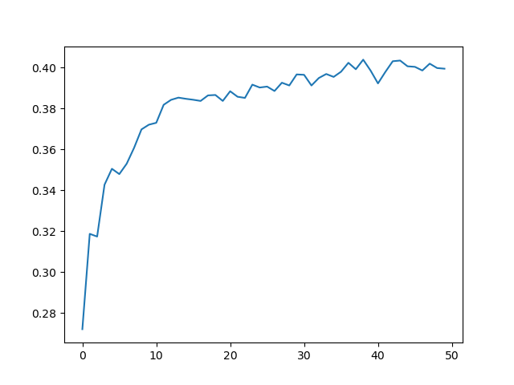

# NaiveVQA

### File Directory

* `data/`
    * `annotations/` -- annotations data (ignored)
    * `images/` -- images data (ignored)
    * `questions/` -- questions data (ignored)
    * `results/` -- now contains only a fake results, for evaluation demo at `PythonEvaluationTools/vqaEvalDemo.py`
    * `clean.py` -- a script to clean up `train.json` in both `data/annotations/` and `data/questions/`
* `resnet/` -- resnet directory
* `logs/` -- should contain saved `.pth` model files
* `config.py` -- global configure file
* `train.py` -- training
* `view-log.py` -- a tool for visualizing an accuracy\epoch figure
* `val_acc.png` -- a demo for the accuracy\epoch figure
* `model.py` -- the major model
* `preprocess-image.py` -- preprocess the images, using ResNet152 to extract features for further usages
* `preprocess-vocab.py` -- preprocess the questions and annotations to get their vocabularies for further usages
* `data.py` -- dataset, dataloader and data processing code
* `utils.py` -- helper code
* `evaluate.ipynb` -- evaluate a model and visualize the result
* `finetune.ipynb` -- finetune a pretrained model
* `cover_rate.ipynb` -- calculate the selected answers' coverage
* `PythonHelperTools/` (currently not used)
    * `vqaDemo.py` -- a demo for VQA dataset APIs
    * `vqaTools/`
* `PythonEvaluationTools/` (currently not used)
    * `vqaEvalDemo.py` -- a demo for VQA evaluation
    * `vaqEvaluation/`
* `README.md`

### Prerequisite

* Disk with available storage of at least 60GB
* A piece of Nivida GPU

### Quick Begin

Get the VQA dataset from [here](https://drive.google.com/open?id=1_VvBqqxPW_5HQxE6alZ7_-SGwbEt2_zn). Unzip the file and move the subdirectories

* `annotations/`
* `images/`
* `questions/`

into the repository directory `data/`.

Prepare your dataset with:

```bash
# Only run the following command once!

cd data

# Save the original json files
cp annotations/train.json annotations/train_backup.json
cp questions/train.json questions/train_backup.json
cp annotations/val.json annotations/val_backup.json
cp questions/val.json questions/val_backup.json
cp annotations/test.json annotations/test_backup.json
cp questions/test.json questions/test_backup.json

python clean.py # run the clean up script
mv annotations/train_cleaned.json annotations/train.json
mv questions/train_cleaned.json questions/train.json

python align.py # run the aligning script
mv annotations/train_cleaned.json annotations/train.json
mv annotations/val_cleaned.json annotations/val.json
mv annotations/test_cleaned.json annotations/test.json

mv questions/train_cleaned.json questions/train.json
mv questions/val_cleaned.json questions/val.json
mv questions/test_cleaned.json questions/test.json
```

The scripts upon would

* clean up your dataset (there are some images whose ids are referenced in the annotation & question files, while the images themselves don't exist!)
* align the questions' ids for convenience while training

**Preprocess the images** with:

```bash
python preprocess-images.py
```

* If you want to accelerate it, tune up `preprocess_batch_size` at `config.json`
* If you run out of CUDA memory, tune down `preprocess_batch_size` ata `config.json`

The output should be `./resnet-14x14.h5`.

**Preprocess the questions and annotations** to get their vocabularies with:

```bash
python preprocess-vocab.py
```

The output should be `./vocab.json`.

Now, you can **train the model** with:

```bash
python train.py
```

During training, **view the training process** with:

```bash
python view-log.py <path to .pth log>
```

The output `val_acc.png` should look like this:



### More Things

* To evaluate a trained model, check `evaluate.ipynb`.
* To finetune a pretrained model, check `finetune.ipynb`.
* To calculate the selected answers' cover rate (determined by `config.max_answer`), check `cover_rate.ipynb`.

### Acknowledgement

The current version of codes are mostly borrowed from repository [pytorch-vqa](https://github.com/Cyanogenoid/pytorch-vqa).